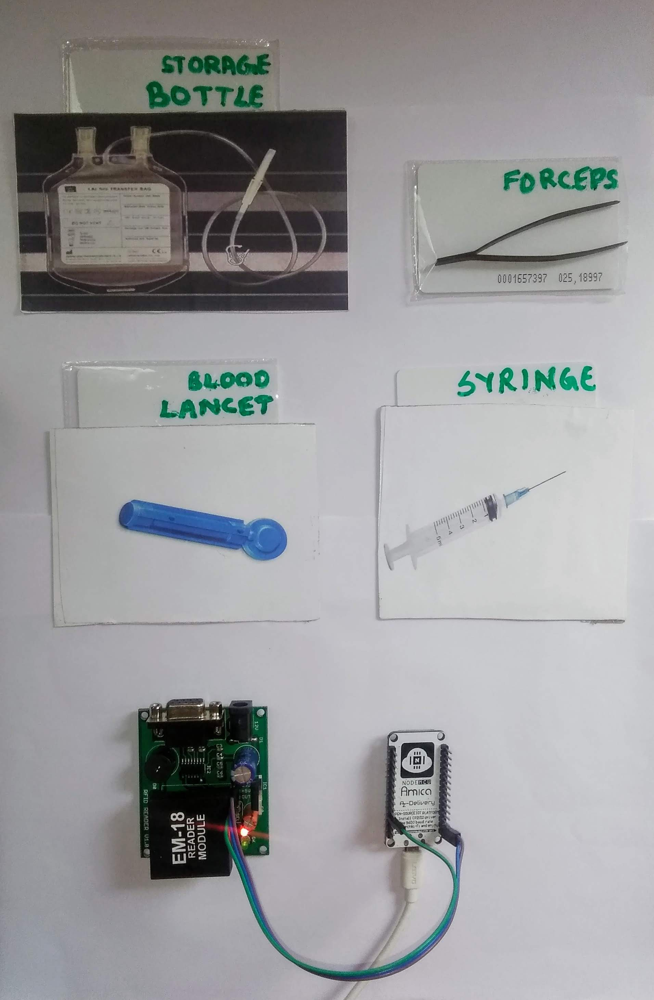
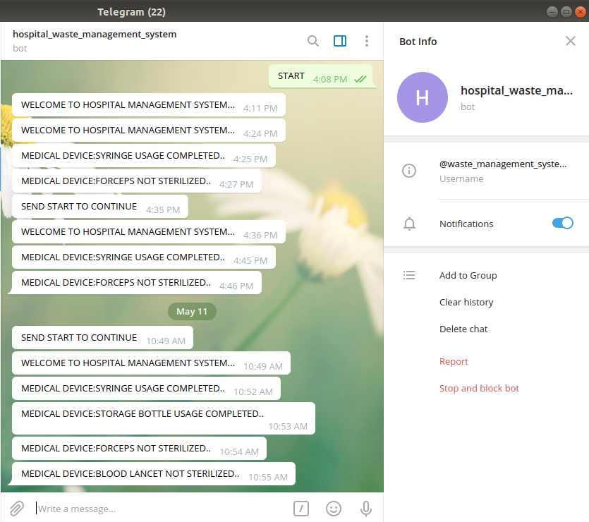
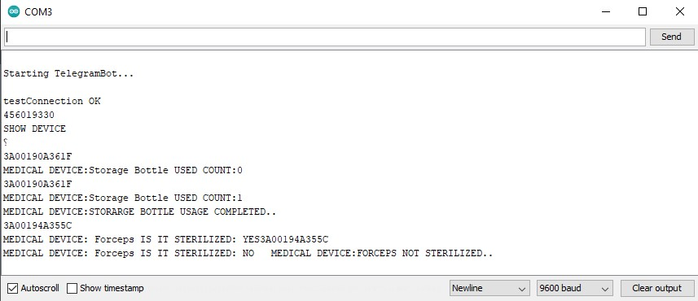

# Hospital_Waste_Management_System

The system targets at alerting on reuse of medical devices. The alert is sent through Telegram.

The different hardware components of the system are as follows:
   1. NodeMCU
   2. RFID Reader
   3. RFID Tags

We assume that, the RFID tags are attached to each medical device used in hospitals. These RFID tags contain the details of the device based on which an alert is generated. The alert generated suggests that the particular medical device has already been used and should not be used again.

The system looks as below:

The alerts on the Telegram BOT is as follows:

The logs on the Serial Monitor of the Arduino IDE is as below:

<a href="https://youtu.be/0c9d9r84Ws8">Click here</a> for the demo of the system.

                                                             Thank You
